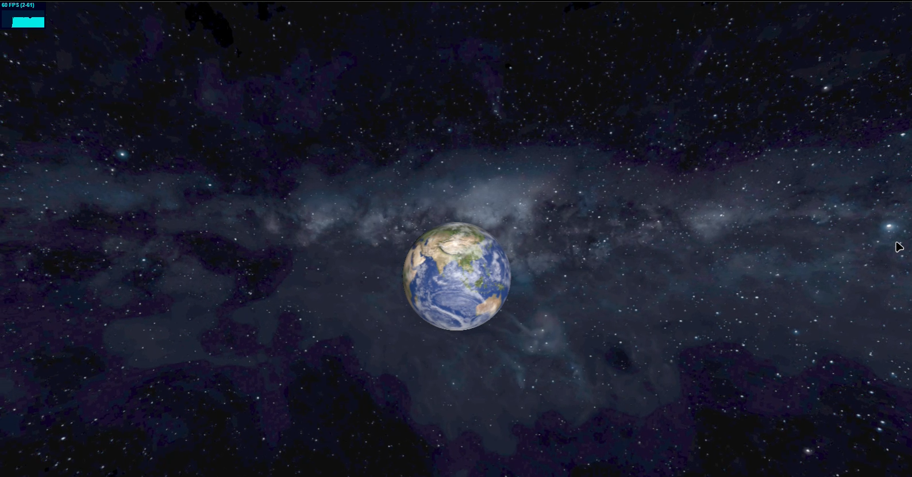

# ORBITA

> **Status:** Pet Project / Learning Three.js & WebGL
> 
> **Tech Stack:** Next.js, TypeScript, Three.js, GLSL

  

ORBITA is a personal project created to practice modern 3D graphics on the web using Three.js. The project focuses on rendering the Earth in real time while experimenting with shaders, lighting, camera movement, and post-processing techniques.

## About the Project

The application renders an interactive 3D Earth scene with realistic lighting and atmospheric effects. The main goal is to explore how WebGL and Three.js can be used to build visually rich, high-performance browser experiences.

Current functionality includes:

* Interactive 3D Earth visualization
* Real-time day/night transition
* Atmospheric glow and cloud rendering
* Camera controls with smooth movement

## What I Practiced

While building ORBITA, I experimented with several rendering techniques:

* Custom shader modifications using `onBeforeCompile`
* Dynamic day / night lighting based on the sun direction
* Atmospheric glow using layered spheres with additive blending
* Camera smoothing to reduce visible jitter
* Dynamic lighting updates for the Earth, Moon, and cloud layers
* Post-processing with `EffectComposer` and `UnrealBloomPass`
* Performance optimization to maintain stable frame rates

## Technologies

* Next.js
* TypeScript
* Three.js
* GLSL
* EffectComposer
* UnrealBloomPass
* Stats.js

## Purpose

ORBITA is primarily a learning project where I explore real-time rendering, shader programming, and 3D graphics with Three.js. It serves as a sandbox for experimenting with different rendering techniques and improving my understanding of WebGL and graphics programming.
